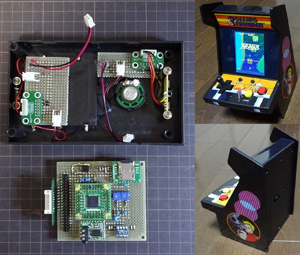
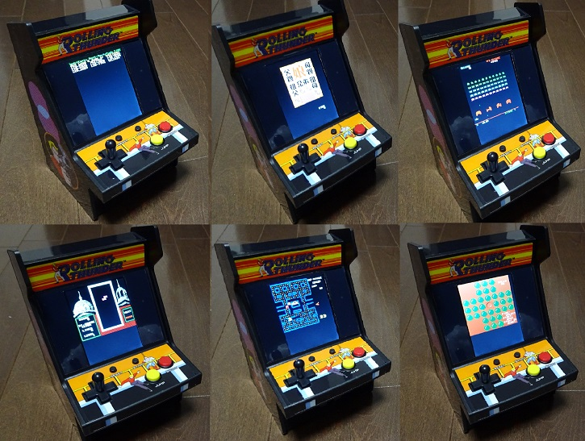

## ソフトの紹介  
　レトロゲームの復刻版　[MyAcade](https://www.myarcadegaming.com/)に  ケンケン様作成の [MachiKania type M](http://www.ze.em-net.ne.jp/~kenken/machikania/typem.html)を組込み  
 　ゲーム機に仕上げました。  
　[小型カラー液晶搭載マイコンゲームシステム](http://www.ze.em-net.ne.jp/~kenken/lcdgame/index.html)を参考にブートローダーとゲームを  
　PIC32MX370F512Hへ移植しました。  

[ケンケン様作成LCDゲーム](http://www.ze.em-net.ne.jp/~kenken/lcdgame/index.html)  
　箱入り娘パズル  
　インベーダー  
　パックマン  
　テトリス  
　ペグソリテア  
　写真立て  
　Veludda  
　[倉庫番](http://braincell.synapse-blog.jp/cell/)  

　おまけ  
　　Xeviousモドキ  
 
## 実機写真   
  
  

## 動作環境  
　[MyAcade](https://www.myarcadegaming.com/)の筐体に組込まなくても　[MachiKania type M](http://www.ze.em-net.ne.jp/~kenken/machikania/typem.html)単体でも起動可能です。  
 
　検証済みLCD  
　　　◆2.4インチ aitedo [M024C9325SLD](https://www.aitendo.com/product/15381 )(ILI9325)  
　　　◆2.4インチ aitendo [UL024C0154D8](https://www.aitendo.com/product/16104)(S6D0154)  
　　　◆2.8インチ aitendo [M028C8347D8](https://www.aitendo.com/product/10942)(HX8347-D)  
　　　　　※（Arduino互換のpin配列に変換が必要）  
　　　◆3.2インチ aitendo [M032C9341B3](https://www.aitendo.com/product/11138)(ILI9341)  
　　　　　※（Arduino互換のpin配列に変換が必要）  
　　　◆3.2インチ aitendo [LCD032-2P](https://www.aitendo.com/product/13748)(SSD1289)  
　　　　　※（Arduino互換のpin配列に変換が必要）  
　　　◆MY ARCADE搭載LCD対応  
　　　　　詳細は[こちら](https://github.com/dozan5/MachiKania_M_Xevious_lcd)を参照ください。  
　　　　　ソフトは縦モードと横モードの両方を用意しました。  
